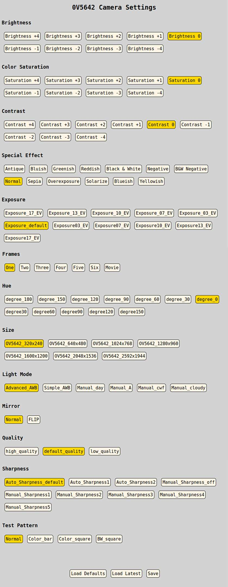

How to Pass a Simple Struct from C++ to JavaScript and Back Again Using Google FlatBuffers
------------------------------------------------------------------------------------------
This project shows how the camera settings for [this camera](https://github.com/patrickmoffitt/5mp_motion_camera/) 
are adjusted using a mobile-responsive web page and then passed via JavaScript and 
[WebSockets](https://en.wikipedia.org/wiki/WebSocket) to a [daemon](https://en.wikipedia.org/wiki/Daemon_(computing)) 
written in C++ and then picked-up again by the camera. The settings themselves are described below in Interface 
Definition Language (IDL). 

 

Interface Definition Language (IDL) for Motion Camera Settings
--------------------------------------------------------------
```idl
// IDL for Motion Camera Settings.

namespace OV5642_Settings;

table Settings {
    jpeg_size:uint8;
    quality:uint8;
    frames:uint8;
    light_mode:uint8;
    color_saturation:uint8;
    brightness:uint8;
    contrast:uint8;
    hue:uint8;
    effect:uint8;
    exposure:uint8;
    sharpness:uint8;
    mirror:uint8;
    test_pattern:uint8;
}

root_type Settings;
```
If you plan to make changes to the IDL copy the above into a file named `motion_camera_settings.fbs ` and follow the
examples below. For more information about FLatBuffers see the 
[reademe.md](https://github.com/patrickmoffitt/flatbuffers/).

Generating motion_camera_settings_generated.h
---------------------------------------------
```bash
./flatc --cpp --force-empty --force-empty-vectors --gen-mutable -o interface/ motion_camera_settings.fbs 
```
Generating motion_camera_settings_generated.js
----------------------------------------------
```bash
./flatc --js --force-empty --force-empty-vectors -o interface/ motion_camera_settings.fbs 
```
This camera project includes a [trivial fork](https://github.com/patrickmoffitt/flatbuffers/) of the Google 
FlatBuffers project. I had to make one or two tiny changes in capitalization to get the project to compile in my 
case-sensitive operating system.

Building
--------
1. Install libpoco on Raspbian Buster
   ```bash
   sudo apt-get install libpoco-dev libpoco-doc libpocofoundation60 \
   libpocojson60 libpoconet60 libpococrypto60 libpocodata60 \
   libpocodatamysql60 libpocodataodbc60 libpocodatasqlite60 \
   libpocoencodings60 libpocomongodb60 libpoconetssl60 libpocoredis60 \
   libpocoutil60 libpocoxml60 libpocozip60
   
   ```
2. Run `cmake` in the usual way in the project root folder.

Installing as a System Service (daemon)
---------------------------------------
-1. Make a directory named `camera_settings` in your home directory.

-2. Copy the contents of the `run` directory from this project into it.

-3. Edit `camera_settings.service` to reflect your username, group, and the path to your home directory. Hint: read
the comments.

-4. As root, copy `camera_settings.service` to `/etc/systemd/system` and enable the 
service:
```bash
    sudo systemctl enable camera_settings.service
    Created symlink /etc/systemd/system/multi-user.target.wants/camera_settings.service → /etc/systemd/system/camera_settings.service.
```

-5. Start the new service and check it's status.
```bash
    sudo systemctl start camera_settings
    sudo systemctl status camera_settings
    ● camera_settings.service - 5MP Camera Settings Service
       Loaded: loaded (/etc/systemd/system/camera_settings.service; enabled; vendor preset: enabled)
       Active: active (exited) since Tue 2020-06-16 15:08:35 EDT; 8min ago
      Process: 3578 ExecStart=/home/patrick/camera_settings/camera_settings --daemon --pidfile camera_settings.pid (code=exited, status=0/SUCCES
     Main PID: 3578 (code=exited, status=0/SUCCESS)
        Tasks: 4 (limit: 4915)
       Memory: 996.0K
       CGroup: /system.slice/camera_settings.service
               └─3582 /home/patrick/camera_settings/camera_settings --daemon --pidfile camera_settings.pid
    
    Jun 16 15:08:35 raspi4 systemd[1]: Started 5MP Camera Settings Service.
```

-6. Edit `camera_settings.properties` in $HOME/camera_settings and change path for the `default_buffer` and
`new_buffer` properties to reflect your home directory path. While you're in there you can change the WebSocket port
if desired. If you do, be sure to reflect the change in the `platformio.ini` for the camera. Change `SOCKET_PORT`
to the same number.
```ini
    WebSocketServer.port: 8880
    WebSocketServer.default_buffer: /home/patrick/camera_settings/default_buffer.bin
    WebSocketServer.new_buffer: /home/patrick/camera_settings/new_buffer.bin
```   

Resources
---------
The camera_settings binary has the ability to verify and compare the default and new buffers and report validity, 
matches and differences. This is helpful as a way to test that the web application is working as expected. In the 
following sample both buffers are valid but the frames setting has been incremented in the new buffer so they don't
match.
```bash
./camera_settings --compare
Comparing: /home/patrick/camera_settings/default_buffer.bin, /home/patrick/camera_settings/new_buffer.bin

flatbuffers::VerifySettingsBuffer PASSED for default_buffer.bin

flatbuffers::VerifySettingsBuffer PASSED for new_buffer.bin

key               default   new       match     
-------------------------------------------
jpeg_size         0         0         true      
quality           1         1         true      
frames            0         1         false     
light_mode        0         0         true      
color_saturation  4         4         true      
brightness        4         4         true      
effect            7         7         true      
contrast          4         4         true      
hue               6         6         true      
exposure          5         5         true      
sharpness         0         0         true      
mirror            7         7         true      
test_pattern      7         7         true      

Compare result: buffers DO NOT match.

```

Credits
-------
- Thank you to [obiltschnig](https://github.com/obiltschnig) and the [Poco Project Team](https://pocoproject.org/) for
providing the [example and library code](https://github.com/pocoproject/poco/tree/master/Net/samples/WebSocketServer) 
from which the WebSocket server in this project is built. 
- Thank you to the [FlatBuffer contributors](https://github.com/google/flatbuffers/graphs/contributors) for the 
[Google FlatBuffer](https://github.com/google/flatbuffers) project.
- Thank you to [Vestride](https://github.com/Vestride) for the [Fancy Index project](https://github.com/Vestride/fancy-index)
from which I built the web page in this project.

Bugs, Issues, and Pull Requests
------------------------------
If you find a bug please create an issue. If you'd like to contribute please send a pull request.

Documentation
-------------
I used Doxygen to create the project documentation. [You can read it here.](https://patrickmoffitt.github.io/camera_settings/)

References
----------
The following were helpful references in the development of this project.

- [Google FlatBuffers Documentation](https://google.github.io/flatbuffers/)
- [Writing WebSocket Servers](https://developer.mozilla.org/en-US/docs/Web/API/WebSockets_API/Writing_WebSocket_servers)
